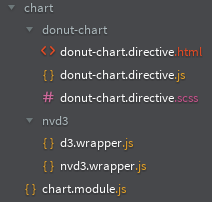
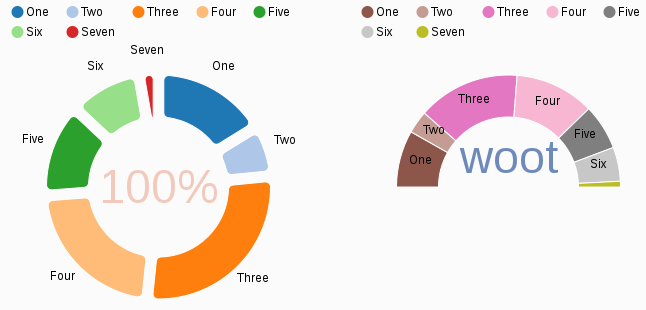

## Intégration de librairies non angular - directives

* Sommaire: [Pour aller plus loin avec Angular 1.4](02.00.angular-intermediate.documentation-fr.md)
* Page précédente: [Interractions avec des bibliothèques non-angular - services](02.05.non-ng-libs.service-fr.md)
* Page suivante: [D3 - data-driven documents](02.07.d3-fr.md)

### Généralités

Si la librairie intégère des comportements graphiques, il convient de l'encapsuler dans une directive. 

Afin d'accéder à la librairie, la directive utilisera un service wrapper.

Exemple:

``` js
    angular.module('tw.practice.map').directive('twLeafletMap', twLeafletMap);

    function twLeafletMap() {
        return {
            templateUrl: 'app/components/map/leaflet/leaflet-map.directive.html',
            controllerAs: 'vm',
            scope: {
                // scope parameters here
            },
            bindToController: true,
            controller: TwLeafletMapController
        };
    }

    /** @ngInject */
    function TwLeafletMapController($scope, $log, $timeout, twLeaflet) {

        var vm = this;

        // ...

        function renderMap() {

            // usage of twLeaflet wrapper service
            vm.map = twLeaflet.map('tw-map-id').setView(vm.config);
```

### Intégration d'ue librairie - en pratique

Pour intégrer une librairie via une directive, il y a au moins 2 approches possibles:
* intégration progressive à partir d'un exemple (quick start ou exemple complexe)
* création "from scratch" à partir de la documentation

Une approche itérative en démarrant avec un exemple puis en consultant peu à peu la documentation permet de démarrer rapidement, tout en montant progressivement en compétence au fur et à mesure des besoins.

#### Intégration statique des fichiers

Pour commencer, se référer à un exemple (simple de préférence) et intégrer le code brut CSS, JS et HTML dans les fichiers correspondants de l'application.



Vérifier que l'exemple se charge correctement dans la page:



#### Nettoyage de l'exemple

Les différents étapes sont ensuite:
* nettoyage du code, style, templates pour retirer les éléments inutiles (par exemple, ici, il y a 2 donuts, alors que notre exemple n'en requiert qu'un seul)
* appel aux services wrappers au lieu des services natifs

### Définir l'API

Avant de démarrer l'intégration d'une librairie, il faut commencer par concevoir l'API de la directive, exposée via les paramètres du scope.

Parmis les besoins fréquents:
* de personaliser l'initialisation du composant
* de synchroniser le modèle de données
* de réagir aux évênements (ce qui peut être fait directement via le modèle de données)

Pour un usage interne, il n'est pas nécessaire d'exposer à travers des paramètres toutes les fonctionnalités de la librairie tierce, mais seulement ce qui est utile à l'application.

### Implémentation de l'API

* implementation des tests unitaires
* implémentation progressive de l'API

#### Synchronisation du modèle vers la librairie

La librairie ne connaissant pas le contexte d'angular, il faut se mettre manuellement à l'écoute du modèle afin de mettre à jour la librairie en cas de changement:

Exemple avec D3:

``` js
$scope.$watch('vm.chartData', function (chartData) {
    if (chartData) {
          twD3.select('#' + vm.chartConfig.cssId)
            .datum(chartData)
              .transition().duration(1200)
            .call(chart1);
    }
});
```
#### Mise à jour du modèle depuis la librairie

Pour mettre à jour le modèle depuis la librairie, il faut se mettre à l'écoute de ses listeners.

Exemple avec leaflet:

``` js
vm.map = twLeaflet.map('tw-map-id').setView(vm.config);

vm.map.on('click', function (e) {
    // propagate the event
    vm.mapConfig.events.click(e);

    // or update the model
    vm.item.location = e.latlng;
});
```