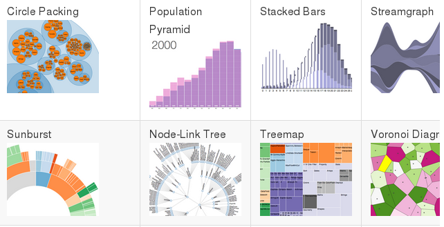
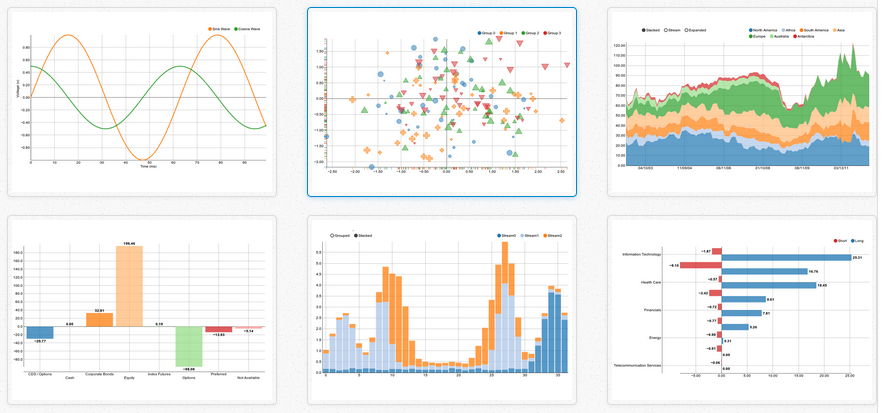

## D3 - data-driven documents

* Sommaire: [Pour aller plus loin avec Angular 1.4](02.00.angular-intermediate.documentation-fr.md)
* Page précédente: [Interractions avec des bibliothèques non-angular - directives](02.06.non-ng-libs.directive-fr.md)
* Page suivante: [Web mapping avec leaflet](02.08.leaflet-fr.md)

### Présentation

D3.js permet d'afficher des données sous la forme de graphiques dynamiques.



*Resources*: 

* [D3](http://d3js.org/): data-driven documents
* [D3 gallery](https://github.com/mbostock/d3/wiki/Gallery): exemples de réalisation
* [D3 and Angular](https://www.dashingd3js.com/d3-resources/d3-and-angular): a list of D3 angular resources
* [Vega and D3](https://github.com/vega/vega/wiki/Vega-and-D3): a visualization grammar (pour aller plus loin)

## NVD3 - composants D3 réutilisables

D3 étant une librairie puissante, mais bas niveau, NVD3 propose des composants réutilisables basés sur D3.



*Resources*: 
* [NVD3](https://github.com/novus/nvd3): re-usable charts and chart components for d3.js


### NVD3 - intégration à l'application

Installation de D3 et NVD3 via bower:

``` bash
bower install --save nvd3
```

Création d'un module spécifique:

``` js
angular.module('tw.practice.chart', []);
```

Création d'un wrapper pour chacune des librairies:
``` js
angular.module('tw.practice.chart').factory('twD3', twD3);

/** @ngInject */
function twD3($window, $log) {
   // ...
}

angular.module('tw.practice.chart').factory('twNvd3', twNvd3);
```
Se reporter au chapitre sur les wrappers.

*Resources*: 
* [Intégration de librairies non angular](02.05.non-ng-libs.service-fr.md)

### NVD3 - création d'une directive

La documentation étant limitée, la meilleure approche est l'intégration d'un exemple.

*Resources*: 
* [Intégration de librairies non angular - directives](02.06.non-ng-libs.directive-fr.md)
* [Exemple donutChart](https://github.com/nvd3-community/nvd3/blob/gh-pages/examples/donutChart.html)