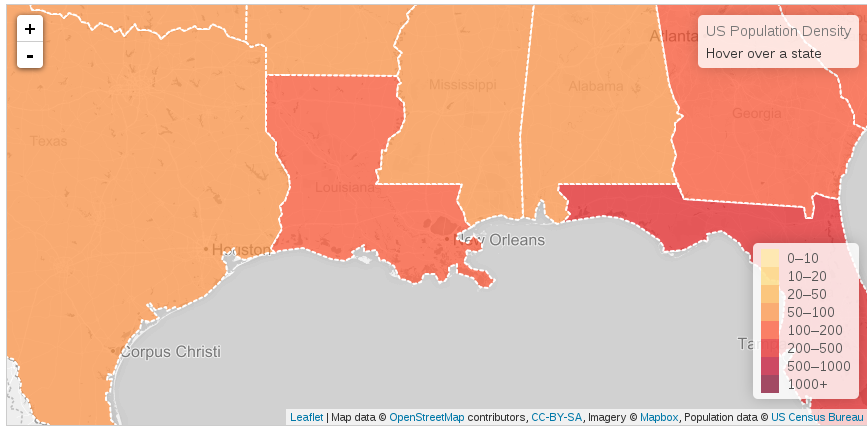

## Web mapping avec Leaflet

* Sommaire: [Pour aller plus loin avec Angular 1.4](02.00.angular-intermediate.documentation-fr.md)
* Page précédente: [D3 - data-driven documents](02.07.d3-fr.md)
* Page suivante: [JSON Patch](02.09.json-patch-fr.md)

### Introduction

Librairie permettant de manipuler des cartes, d'interragir avec elles et d'y afficher des données (Web mapping).

Les fonds de cartes (tiles) peuvent provenir de Google Map, Bing, Open Street Map, ou encore de fond personnalisés générés à partir de données mixtes (publiques, internes).



*Resources:*

* [leaflet](http://leafletjs.com/)
* [tilemill](https://github.com/mapbox/tilemill): excellent outil de création de tiles
* [kosmtik](https://github.com/kosmtik/kosmtik): nouveau projet proche de tilemill
* [Mapbox Studio Classic](https://github.com/mapbox/mapbox-studio-classic): équivalent de tilemill intégré à Mapbox

### Leaflet - utilisation d'une directive tierce

Une directive permet d'utiliser simplement leaflet dans une application angular. Le projet vient d'être intégré à angular-ui.

Elle est pour le moment sous-documentée, mais, en fonction du besoin, il peut-être pertinent de s'appuyer dessus quand elle le sera.

*Resources:*

* [ui-leaflet](https://github.com/angular-ui/ui-leaflet): directive leaflet

### Leaflet - intégration à l'application


Installation via bower de la version en cours de développement:

``` bash
bower install --save leaflet#1.0.0-beta.2
```
Création d'un module spécifique:

``` js
angular.module('tw.practice.map', []);
```

Création d'un wrapper (en mode noConflict):

``` js
angular.module('tw.practice.map').factory('twLeaflet', twLeaflet);

/** @ngInject */
function twLeaflet($window, $log) {
    if (!$window.L) {
        $log.error('Global L variable is not available.');
        return null;
    }

    var service = $window.L.noConflict();

    return service;
}
```
Se reporter au chapitre sur les wrappers.

*Resources*: 
* [Leaflet](http://leafletjs.com)
* [Intégration de librairies non angular](02.05.non-ng-libs.service-fr.md)

### Leaflet - création d'une directive

La documentation et les exemples étant bien fournis, il est possible d'encapsuler leaflet via un exemple ou from scratch.

*Resources*: 
* [Intégration de librairies non angular - directives](02.06.non-ng-libs.directive-fr.md)
* [Leaflet - documentation](http://leafletjs.com/reference.html)
* [Leaflet - exemples](http://leafletjs.com/examples.html)
